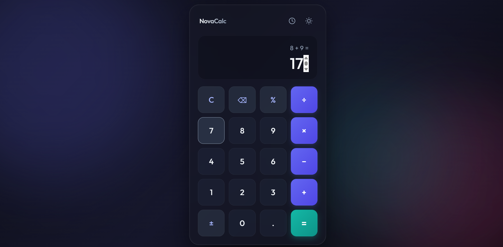
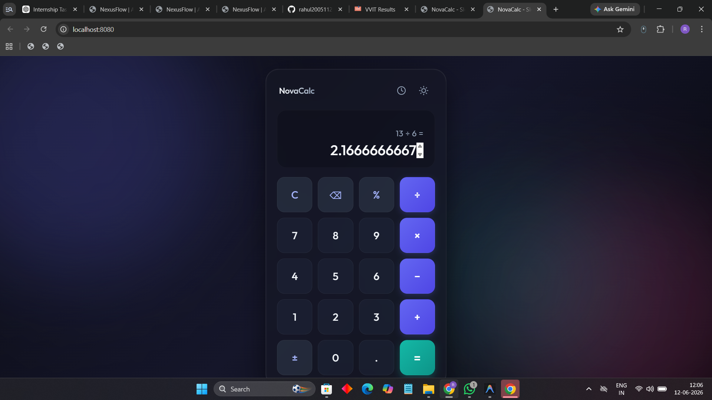
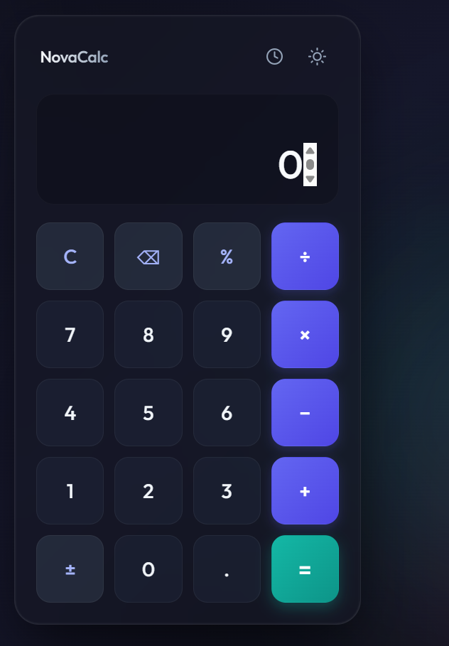

# SCT_WD_2
# 🧮 Calculator Web Application

A modern and responsive Calculator Web Application developed as **Task 2** of the **SkillCraft Technology Web Development Internship**.

## 🚀 Project Overview

This project is a fully functional calculator built using HTML, CSS, and JavaScript. It performs basic arithmetic operations with a clean and user-friendly interface. The application is designed to provide accurate calculations while demonstrating essential web development concepts such as DOM manipulation, event handling, and responsive design.

## ✨ Features

* Addition (+)
* Subtraction (-)
* Multiplication (×)
* Division (÷)
* Decimal Number Support
* Clear (C) Function
* Delete (⌫) Function
* Keyboard Input Support
* Error Handling
* Responsive Design
* Modern User Interface

## 🛠️ Technologies Used

* HTML5
* CSS3
* JavaScript (ES6)

## 📂 Project Structure

```text
SCT_WD_2/
│
├── index.html
├── style.css
├── script.js
├── screenshots/
└── README.md
```

## 📸 Project Screenshots

### Calculator Interface



### Calculation Example



### Responsive Mobile View



## 🎯 Objectives

The objective of this project is to create a functional and interactive calculator that allows users to perform mathematical calculations efficiently while showcasing front-end web development skills.

## 💡 Key Concepts Implemented

* DOM Manipulation
* Event Handling
* JavaScript Functions
* Keyboard Events
* Responsive Web Design
* User Interface Development
* Error Handling

## 📱 Responsive Design

The application is optimized for:

* Desktop Computers
* Laptops
* Tablets
* Mobile Devices

## 🔮 Future Enhancements

* Scientific Calculator Functions
* Calculation History
* Dark Mode
* Theme Customization
* Advanced Mathematical Operations

## 📖 Learning Outcomes

Through this project, I gained practical experience in:

* Building interactive web applications
* Implementing calculator logic using JavaScript
* Handling user input and keyboard events
* Creating responsive layouts
* Improving user experience through UI design

## 🙏 Acknowledgement

This project was completed as part of the **SkillCraft Technology Web Development Internship Program**.

⭐ If you found this project useful, feel free to star this repository.
